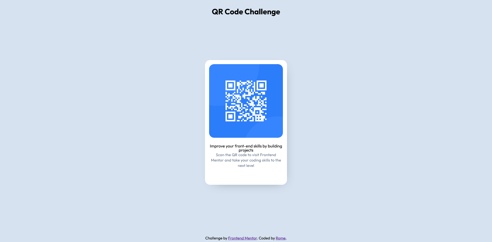

# Frontend Mentor - QR code component solution

This is a solution to the [QR code component challenge on Frontend Mentor](https://www.frontendmentor.io/challenges/qr-code-component-iux_sIO_H). Frontend Mentor challenges help you improve your coding skills by building realistic projects. 

## Table of contents

- [Overview](#overview)
  - [Screenshot](#screenshot)
  - [Links](#links)
- [My process](#my-process)
  - [Built with](#built-with)
  - [What I learned](#what-i-learned)
- [Author](#author)

## Overview

### Screenshot

### Links

- Solution URL: [Add solution URL here](https://github.com/romecalago/qr-code-component-main)
- Live Site URL: [Add live site URL here](https://romecalago.github.io/qr-code-component-main/)

## My process
  step 1: Check all necessary files and visuals
  step 2: Apply html codes and css styles
  step 3: Created a remote repo and just followed the instructions provided in Frontend Mentor
  step 4: pushing all files and updates

### Built with

- Semantic HTML5 markup
- CSS custom properties
- Mobile-first workflow

### What I learned

Before writing any code, I thoroughly reviewed all design files and assets. This ensured I had a clear understanding of what needed to be implemented. Having this clarity allowed me to create a well-planned structure for the HTML and CSS, ensuring I didn't miss any key elements.

Once I understood the visual layout and requirements, I moved on to coding. I focused on writing semantic HTML5, which not only improves accessibility but also makes it easier to maintain the code.

For example, instead of using generic div tags, I used meaningful elements like header, main, and footer to make the code more readable.

Overall, this project has been an excellent learning opportunity, reinforcing the importance of semantic structure, reusable CSS, and maintaining an organized workflow using version control.

**Note: Delete this note and replace the list above with resources that helped you during the challenge. These could come in handy for anyone viewing your solution or for yourself when you look back on this project in the future.**

## Author

- Website - [Rome ](https://romecalago.github.io/portfolio/)
- Frontend Mentor - [@yourusername](https://www.frontendmentor.io/profile/romecalago)
